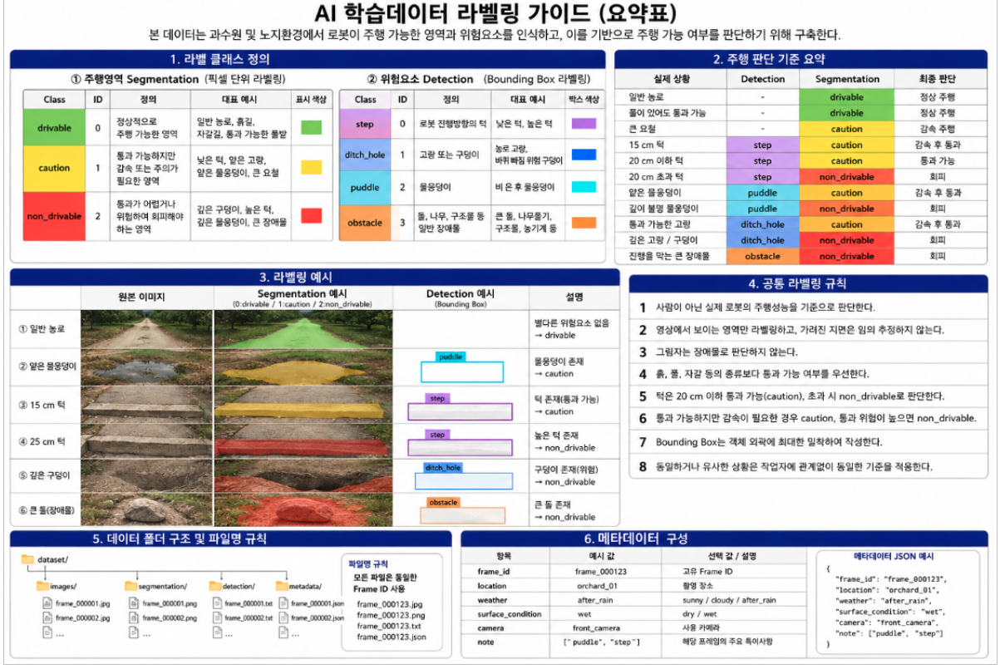

# AI모델 데이터 라벨링 작업명세

> 기준 문서: `AI모델-데이터라벨링가이드_v1.1.odt`
>
> 이 문서는 기준 ODT의 본문 텍스트뿐 아니라 문서 안에 삽입된 이미지·표·요약 인포그래픽의 내용까지 확인하여 AI 작업용 Markdown으로 옮긴 문서다.
> 라벨 의미, 판단 기준, 저장 구조, 파일명, 확장자, 메타데이터 양식을 임의로 변경하지 않는다.
> 이 문서에 없는 별도 정책을 추가하지 않는다.

---

# 1. 라벨링 개요

본 학습데이터는 과수원 및 노지환경에서 카메라 영상을 이용하여
로봇이 주행 가능한 영역과 주행을 방해하는 위험요소를 인식하고,
이를 기반으로 주행 가능 여부를 판단하기 위해 구축한다.

라벨링은 사람의 보행 가능 여부가 아니라
실제 로봇의 차폭, 바퀴, 서스펜션 및 주행성능을 기준으로 판단한다.
기존 기준에서도 주행 가능 영역은 실제 로봇의 폭과 주행성능을 고려하여 판단하도록 하고 있다.

학습데이터는 동일하거나 거의 유사한 연속 프레임을 과도하게 사용하지 않는다.
일반적인 농로뿐 아니라 턱, 고랑, 구덩이, 물웅덩이 및 장애물 등
실제 주행 중 발생 가능한 위험상황을 포함한다.

기존 문서에서는 30 FPS 영상의 경우 약 1~2 FPS 수준의 샘플링을 예시로 제시하고 있다.

## 1.1 전체 라벨 클래스

### Segmentation

| ID | Class | 의미 |
|---:|---|---|
| 0 | `drivable` | 정상 주행 가능 |
| 1 | `caution` | 감속 또는 주의하여 주행 가능 |
| 2 | `non_drivable` | 주행 불가 또는 회피 필요 |

### Detection

| ID | Class | 의미 |
|---:|---|---|
| 0 | `step` | 턱 |
| 1 | `ditch_hole` | 고랑 및 구덩이 |
| 2 | `puddle` | 물웅덩이 |
| 3 | `obstacle` | 돌, 나무, 구조물 등 일반 장애물 |

## 1.2 ODT 요약 인포그래픽의 표시 색상

ODT 마지막 페이지의 `AI 학습데이터 라벨링 가이드 (요약표)`에 표시된 시각화 색상은 다음과 같다.

### Segmentation 표시 색상

| Class | 표시 색상 |
|---|---|
| `drivable` | 초록 |
| `caution` | 노랑 |
| `non_drivable` | 빨강 |

### Detection Bounding Box 표시 색상

| Class | 박스 색상 |
|---|---|
| `step` | 보라 |
| `ditch_hole` | 파랑 |
| `puddle` | 하늘색 |
| `obstacle` | 주황 |

> ODT에는 색의 시각적 구분이 제시되어 있으며, HEX/RGB 숫자값은 별도로 명시되어 있지 않다.
> Overlay 및 검수용 시각화는 위 클래스별 색 구분을 따른다.

---

# 2. 라벨링 작업 가이드

## 2.1 주행영역 Segmentation

카메라 영상의 지면을 픽셀 단위로 구분하여
로봇의 주행 가능 여부를 라벨링한다.

흙, 자갈, 풀 등의 노면 종류를 각각 구분하지 않고,
실제 로봇이 해당 영역을 통과할 수 있는지를 기준으로 다음 3개 클래스를 사용한다.

### 클래스 정의

| ID | Class | 판단 기준 | 대표 예시 |
|---:|---|---|---|
| 0 | `drivable` | 정상적으로 통과 가능 | 일반 농로, 흙길, 자갈길, 통과 가능한 풀밭 |
| 1 | `caution` | 통과 가능하지만 감속 또는 주의 필요 | 낮은 턱, 얕은 고랑, 얕은 물웅덩이, 큰 요철 |
| 2 | `non_drivable` | 통과 위험 또는 불가능 | 높은 턱, 깊은 고랑·구덩이, 깊은 물웅덩이, 큰 장애물 |

### 주행 가능 여부 판단 기준

| 상황 | 라벨 |
|---|---|
| 평탄한 농로 | `drivable` |
| 일반 흙길 또는 자갈길 | `drivable` |
| 풀이 있어도 정상 통과 가능 | `drivable` |
| 큰 요철 | `caution` |
| 얕은 물웅덩이 | `caution` |
| 통과 가능한 고랑 | `caution` |
| 20 cm 이하의 턱 | `caution` |
| 깊은 고랑 또는 구덩이 | `non_drivable` |
| 깊이를 판단하기 어려운 물웅덩이 | `non_drivable` |
| 20 cm를 초과하는 턱 | `non_drivable` |
| 진행을 막는 큰 돌·나무·구조물 | `non_drivable` |

### 턱 판단 기준

로봇은 최대 20 cm 높이의 턱을 통과할 수 있는 것으로 가정한다.

```text
20 cm 이하
→ caution
→ 감속하여 통과 가능

20 cm 초과
→ non_drivable
→ 회피 필요
```

단, 단일 영상만으로 실제 턱 높이를 정확하게 확인하기 어려운 경우
작업자가 임의로 높이를 추정하지 않는다.

### Segmentation 라벨링 예시

한 영상에 일반 농로, 얕은 물웅덩이,
통과 가능한 턱, 깊은 구덩이가 존재하는 경우:

| 영상 내 영역 | Segmentation 결과 |
|---|---|
| 일반 농로 | `drivable` |
| 얕은 물웅덩이 | `caution` |
| 20 cm 이하 턱 | `caution` |
| 깊은 구덩이 | `non_drivable` |

결과는 원본 이미지와 동일한 크기의 Mask 이미지로 저장한다.

Mask 클래스 ID:

```text
0 = drivable
1 = caution
2 = non_drivable
```

---

## 2.2 전방 위험요소 Detection

로봇 전방에서 주행 판단에 직접적인 영향을 주는 위험요소는
Bounding Box 방식으로 별도 라벨링한다.

Bounding Box는 위험요소의 외곽에 최대한 밀착하여 생성하고,
불필요한 배경이 포함되지 않도록 한다.
기존 기준에서도 Bounding Box는 객체 외곽에 최대한 밀착하여 작성하도록 규정하고 있다.

### 클래스 정의

| ID | Class | 라벨 대상 |
|---:|---|---|
| 0 | `step` | 로봇 진행방향의 턱 |
| 1 | `ditch_hole` | 고랑 및 구덩이 |
| 2 | `puddle` | 물웅덩이 |
| 3 | `obstacle` | 돌, 나무, 구조물 등 일반 장애물 |

1차년도에는 고랑과 구덩이 모두
바퀴 빠짐 또는 주행 방해 위험을 판단하기 위한 대상이므로
`ditch_hole` 하나의 클래스로 관리한다.

필요할 경우 향후 `ditch`, `hole`로 분리한다.

### Detection 라벨링 예시

영상에 물웅덩이와 턱이 존재하는 경우:

| 실제 대상 | Detection Class | 작업 방식 |
|---|---|---|
| 물웅덩이 | `puddle` | 물웅덩이 외곽에 Bounding Box |
| 턱 | `step` | 턱 영역에 Bounding Box |

YOLO 형식을 사용할 경우:

```text
<class_id> <center_x> <center_y> <width> <height>
```

예:

```text
2 0.274 0.621 0.213 0.184
0 0.701 0.692 0.302 0.121
```

위 예시는 다음을 의미한다.

```text
2 = puddle
0 = step
```

---

## 2.3 Segmentation과 Detection 적용 예시

Detection과 Segmentation은 역할을 구분하여 사용한다.

```text
Detection = 앞에 무엇이 있는지 판단
Segmentation = 해당 영역을 갈 수 있는지 판단
```

| 실제 상황 | Detection | Segmentation | 주행 판단 |
|---|---|---|---|
| 15 cm 턱 | `step` | `caution` | 감속 후 통과 |
| 25 cm 턱 | `step` | `non_drivable` | 회피 |
| 얕은 물웅덩이 | `puddle` | `caution` | 감속 후 통과 |
| 깊은 물웅덩이 | `puddle` | `non_drivable` | 회피 |
| 통과 가능한 얕은 고랑 | `ditch_hole` | `caution` | 감속 후 통과 |
| 깊은 구덩이 | `ditch_hole` | `non_drivable` | 회피 |
| 진행을 막는 큰 돌 | `obstacle` | `non_drivable` | 회피 |

15 cm 턱:

```text
Detection : step
+
Segmentation : caution
↓
턱이 존재하며 감속하여 통과 가능
```

25 cm 턱:

```text
Detection : step
+
Segmentation : non_drivable
↓
턱이 존재하며 통과 불가
```

Detection 클래스를
`step_passable`, `step_non_passable`처럼 별도로 나누지 않는다.

## 2.3.1 ODT 실제 라벨링 예시 이미지 — 검수 기준

ODT 마지막 페이지의 요약 인포그래픽에는 다음 6개 실제 예시가
`원본 이미지 → Segmentation 예시 → Detection 예시 → 설명`
형태로 제시되어 있다.

| 예시 | Segmentation | Detection | 설명 |
|---|---|---|---|
| 일반 농로 | `drivable` | 없음 | 별다른 위험요소 없음 → drivable |
| 얕은 물웅덩이 | `caution` | `puddle` | 물웅덩이 존재 → caution |
| 15 cm 턱 | `caution` | `step` | 턱 존재(통과 가능) → caution |
| 25 cm 턱 | `non_drivable` | `step` | 높은 턱 존재 → non_drivable |
| 깊은 구덩이 | `non_drivable` | `ditch_hole` | 구덩이 존재(위험) → non_drivable |
| 큰 돌(장애물) | `non_drivable` | `obstacle` | 큰 돌 존재 → non_drivable |

파일럿 샘플과 Overlay를 검수할 때
이 6개 예시의 Class 적용 방식과 시각화 패턴을 정답 레퍼런스로 사용한다.

레퍼런스 파일:

```text
라벨링_정답_레퍼런스/
├── 00_ODT_요약_인포그래픽.png
├── 01_일반_농로.png
├── 02_얕은_물웅덩이.png
├── 03_15cm_턱.png
├── 04_25cm_턱.png
├── 05_깊은_구덩이.png
└── 06_큰_돌_장애물.png
```


---

## 2.4 공통 라벨링 규칙

1. 사람이 아닌 실제 로봇의 주행성능을 기준으로 판단한다.
2. 영상에서 실제로 보이는 영역만 라벨링하며, 가려진 지면을 임의로 추정하지 않는다.
3. 그림자는 장애물로 판단하지 않는다. 그림자가 있어도 실제 주행 가능한 지면이면 `drivable`로 처리한다.
4. 흙, 풀, 자갈 등의 노면 종류보다 로봇의 통과 가능 여부를 우선한다.
5. 통과 가능하지만 감속이 필요한 경우 `caution`, 통과 위험성이 높거나 불가능한 경우 `non_drivable`로 처리한다.
6. Bounding Box는 실제 위험요소 외곽에 최대한 밀착한다.
7. 동일하거나 유사한 상황은 작업자에 관계없이 동일한 기준으로 라벨링한다.

---

# 3. 데이터 저장 구조

GPS와 LiDAR 데이터는 본 라벨링 데이터 구성에서 제외한다.

데이터는 원본 이미지, Segmentation, Detection, Metadata를 분리하여 관리한다.
기존 문서에서도 원본 이미지, Segmentation, Detection 및 Metadata를 분리하여 관리하는 구조를 제시하고 있다.

최종 저장 구조와 파일명 및 확장자는 반드시 다음 형식을 사용한다.

```text
dataset/
├── images/
│   ├── frame_000001.jpg
│   ├── frame_000002.jpg
│   └── frame_000003.jpg
├── segmentation/
│   ├── frame_000001.png
│   ├── frame_000002.png
│   └── frame_000003.png
├── detection/
│   ├── frame_000001.txt
│   ├── frame_000002.txt
│   └── frame_000003.txt
└── metadata/
    ├── frame_000001.json
    ├── frame_000002.json
    └── frame_000003.json
```

## 3.1 폴더별 저장 내용

| 폴더 | 저장 내용 |
|---|---|
| `images/` | 카메라 원본 이미지 |
| `segmentation/` | `drivable` / `caution` / `non_drivable` Mask |
| `detection/` | `step` / `ditch_hole` / `puddle` / `obstacle` Bounding Box |
| `metadata/` | 촬영 환경에 대한 부가정보 |

## 3.2 파일명 규칙

하나의 원본 영상과 관련된 모든 데이터는
동일한 Frame ID를 사용한다.

예:

```text
images/frame_000123.jpg
segmentation/frame_000123.png
detection/frame_000123.txt
metadata/frame_000123.json
```

즉 `frame_000123`이라는 동일한 ID를 기준으로
원본 이미지와 각 라벨을 연결한다.

---

# 4. 메타데이터 작성 가이드

메타데이터는 모델 학습 자체를 위한 라벨이 아니라
촬영환경별 데이터 관리 및 향후 모델 성능 분석을 위한 부가정보이다.
기존 문서에서도 촬영 위치, 날씨, 노면, 카메라 및 특이사항 등을 메타데이터로 관리하도록 하고 있다.

## 4.1 메타데이터 항목

| 항목 | 값 예시 | 설명 |
|---|---|---|
| `frame_id` | `frame_000123` | 이미지 및 라벨 연결용 ID |
| `location` | `orchard_01` | 촬영 장소 |
| `weather` | `sunny` | 촬영 당시 날씨 |
| `surface_condition` | `wet` | 노면 상태 |
| `camera` | `front_camera` | 촬영 카메라 |
| `note` | `["puddle", "step"]` | 해당 프레임의 주요 특이사항 |

## 4.2 메타데이터 값 정의

날씨:

```text
sunny : 맑음
cloudy : 흐림
after_rain : 비 온 후
```

노면 상태:

```text
dry : 건조
wet : 젖음
```

## 4.3 JSON 작성 예시

비가 온 후 과수원에서 물웅덩이와 턱이 촬영된 경우:

```json
{
  "frame_id": "frame_000123",
  "location": "orchard_01",
  "weather": "after_rain",
  "surface_condition": "wet",
  "camera": "front_camera",
  "note": [
    "puddle",
    "step"
  ]
}
```

## 4.4 하나의 프레임 최종 구성

```text
frame_000123
├── images/
│   └── frame_000123.jpg
├── segmentation/
│   └── frame_000123.png
├── detection/
│   └── frame_000123.txt
└── metadata/
    └── frame_000123.json
```

---

# 5. 라벨링 기준 요약표

| 구분 | Class | ID | 라벨링 대상 / 판단 기준 | 주행 판단 | 작업 방식 | 예시 |
|---|---|---:|---|---|---|---|
| 주행영역 | `drivable` | 0 | 로봇이 정상적으로 통과 가능한 지면 | 정상 주행 | Segmentation | 평탄한 농로, 흙길, 자갈길, 통과 가능한 풀밭 |
| 주행영역 | `caution` | 1 | 통과 가능하지만 감속 또는 주의가 필요한 지면 | 감속 / 주의 | Segmentation | 큰 요철, 얕은 물웅덩이, 통과 가능한 고랑, 20 cm 이하 턱 |
| 주행영역 | `non_drivable` | 2 | 통과가 어렵거나 위험하여 회피해야 하는 영역 | 회피 | Segmentation | 깊은 구덩이, 깊은 고랑, 깊이 불명 물웅덩이, 20 cm 초과 턱, 큰 장애물 |
| 위험요소 | `step` | 0 | 로봇 진행방향의 턱 | Segmentation 결과와 함께 판단 | Bounding Box | 낮은 턱, 높은 턱 |
| 위험요소 | `ditch_hole` | 1 | 고랑 또는 구덩이 | 통과 가능 → `caution`, 위험 → `non_drivable` | Bounding Box | 농로 고랑, 바퀴 빠짐 위험 구덩이 |
| 위험요소 | `puddle` | 2 | 물웅덩이 | 얕음 → `caution`, 깊거나 불명확 → `non_drivable` | Bounding Box | 비 온 후 물웅덩이 |
| 위험요소 | `obstacle` | 3 | 진행을 방해하는 돌, 나무, 구조물 등 | 통과 가능 여부에 따라 판단 | Bounding Box | 큰 돌, 나무줄기, 구조물 |

---

# 6. 주행 판단 핵심 기준

| 실제 상황 | Detection | Segmentation | 최종 판단 |
|---|---|---|---|
| 일반 농로 | 없음 | `drivable` | 정상 주행 |
| 풀이 있지만 통과 가능 | 없음 | `drivable` | 정상 주행 |
| 큰 요철 | 없음 | `caution` | 감속 주행 |
| 15 cm 턱 | `step` | `caution` | 감속 후 통과 |
| 20 cm 이하 턱 | `step` | `caution` | 통과 가능 |
| 20 cm 초과 턱 | `step` | `non_drivable` | 회피 |
| 얕은 물웅덩이 | `puddle` | `caution` | 감속 후 통과 |
| 깊이 판단이 어려운 물웅덩이 | `puddle` | `non_drivable` | 회피 |
| 통과 가능한 고랑 | `ditch_hole` | `caution` | 감속 후 통과 |
| 깊은 고랑 / 구덩이 | `ditch_hole` | `non_drivable` | 회피 |
| 진행을 막는 큰 돌 | `obstacle` | `non_drivable` | 회피 |

핵심 원칙:

```text
Detection = 앞에 무엇이 있는가?
Segmentation = 그곳을 로봇이 갈 수 있는가?
```

---

# 7. 공통 작업 규칙 요약

| 항목 | 작업 기준 |
|---|---|
| 판단 기준 | 사람 기준이 아닌 실제 로봇의 주행성능 기준 |
| 턱 | 20 cm 이하 통과 가능, 초과 시 주행 불가 |
| 그림자 | 장애물로 라벨링하지 않음 |
| 가려진 영역 | 보이지 않는 영역을 임의로 추정하지 않음 |
| 흙·풀·자갈 | 종류를 별도로 구분하지 않고 통과 가능 여부로 판단 |
| Bounding Box | 위험요소 외곽에 최대한 밀착 |
| 애매한 지형 | 감속하면 통과 가능 → `caution`, 통과 위험 → `non_drivable` |

기존 문서 역시 보이지 않는 지면을 임의로 추정하지 않고,
그림자는 실제 노면 기준으로 처리하며,
Bounding Box는 객체 외곽에 밀착하도록 규정하고 있다.

---

# 8. 파일 및 메타데이터 요약

## 8.1 파일

| 구분 | 저장 위치 | 예시 |
|---|---|---|
| 원본 이미지 | `images/` | `frame_000123.jpg` |
| 주행영역 라벨 | `segmentation/` | `frame_000123.png` |
| 위험요소 라벨 | `detection/` | `frame_000123.txt` |
| 메타데이터 | `metadata/` | `frame_000123.json` |

모든 파일은 동일한 Frame ID를 사용한다.

```text
frame_000123.jpg
frame_000123.png
frame_000123.txt
frame_000123.json
```

## 8.2 메타데이터

| 항목 | 예시 | 선택값 |
|---|---|---|
| `frame_id` | `frame_000123` | 고유 Frame ID |
| `location` | `orchard_01` | 촬영 장소 |
| `weather` | `after_rain` | `sunny`, `cloudy`, `after_rain` |
| `surface_condition` | `wet` | `dry`, `wet` |
| `camera` | `front_camera` | 사용 카메라 |
| `note` | `["puddle","step"]` | 주요 위험요소 |

```json
{
  "frame_id": "frame_000123",
  "location": "orchard_01",
  "weather": "after_rain",
  "surface_condition": "wet",
  "camera": "front_camera",
  "note": [
    "puddle",
    "step"
  ]
}
```

---

# 9. 최종 작업 규칙

ODT를 다시 대조하거나 이 Markdown을 재생성하는 작업이 필요한 경우에는
문단 텍스트만 추출하지 말고 ODT 안에 삽입된 모든 이미지·표·요약 인포그래픽을 실제로 열어 내용을 확인한다.
이미지 안에만 존재하는 Class 색상, 예시, 파일 규칙을 누락하면 문서 변환 실패로 처리한다.


1. 사람 기준이 아니라 실제 로봇의 주행성능을 기준으로 판단한다.
2. 영상에서 실제로 보이는 영역만 라벨링하고 가려진 지면을 임의로 추정하지 않는다.
3. 그림자를 장애물로 판단하지 않는다.
4. 흙, 풀, 자갈의 종류보다 실제 통과 가능 여부를 우선한다.
5. 감속하면 통과 가능하면 `caution`, 통과 위험성이 높거나 불가능하면 `non_drivable`로 판단한다.
6. Bounding Box는 실제 위험요소 외곽에 최대한 밀착한다.
7. 턱은 20 cm 이하 `caution`, 20 cm 초과 `non_drivable`로 판단한다.
8. 단일 영상만으로 턱 높이를 정확히 알 수 없으면 임의로 높이를 추정하지 않는다.
9. 고랑과 구덩이는 1차년도에 `ditch_hole` 하나의 Detection 클래스로 관리한다.
10. Detection은 앞에 무엇이 있는지, Segmentation은 해당 영역을 갈 수 있는지 판단한다.
11. 최종 데이터는 `images`, `segmentation`, `detection`, `metadata` 4개 폴더로 분리한다.
12. 모든 파일은 동일한 `frame_XXXXXX` Frame ID로 연결한다.
13. 최종 파일명 및 확장자는 `images/frame_XXXXXX.jpg`, `segmentation/frame_XXXXXX.png`, `detection/frame_XXXXXX.txt`, `metadata/frame_XXXXXX.json` 형식을 반드시 지킨다.
14. Metadata는 `frame_id`, `location`, `weather`, `surface_condition`, `camera`, `note` 항목을 사용한다.
15. `weather` 값은 `sunny`, `cloudy`, `after_rain`을 사용한다.
16. `surface_condition` 값은 `dry`, `wet`을 사용한다.
17. 동일하거나 거의 유사한 연속 프레임을 과도하게 사용하지 않는다.


# 10. 시각화 색상 코드 (ODT 요약표 기준)

라벨링 결과를 Overlay로 시각화하거나 검수할 때 아래 색상 기준을 따른다.
이 색상 코드는 ODT 원본의 요약표 이미지에 정의되어 있다.

## 10.1 Segmentation 색상

| ID | Class | 색상 |
|---:|---|---|
| 0 | `drivable` | 초록색 |
| 1 | `caution` | 노란색 |
| 2 | `non_drivable` | 빨간색 |

## 10.2 Detection Bounding Box 색상

| ID | Class | 색상 |
|---:|---|---|
| 0 | `step` | 보라색 |
| 1 | `ditch_hole` | 분홍색 |
| 2 | `puddle` | 하늘색 |
| 3 | `obstacle` | 주황색 |

---

# 11. 라벨링 정답 예시 (ODT 요약표 기준)

ODT 요약표에 제시된 6가지 대표 시나리오와 정답 판단은 다음과 같다.
실제 예시 이미지는 `AI모델-데이터라벨링가이드_v1_1.odt` 마지막 페이지 요약표 참조.

| 번호 | 장면 | Segmentation 판단 | Detection 판단 | 설명 |
|---:|---|---|---|---|
| 1 | 일반 농로 | `drivable` | 없음 | 별다른 위험요소 없음 → drivable |
| 2 | 얕은 물웅덩이 | `caution` | `puddle` | 물웅덩이 존재 → caution |
| 3 | 15 cm 턱 | `caution` | `step` | 턱 존재(통과 가능) → caution |
| 4 | 25 cm 턱 | `non_drivable` | `step` | 높은 턱 존재 → non_drivable |
| 5 | 깊은 구덩이 | `non_drivable` | `ditch_hole` | 구덩이 존재(위험) → non_drivable |
| 6 | 큰 돌(장애물) | `non_drivable` | `obstacle` | 큰 돌 존재 → non_drivable |

---

# 12. 원본 문서 대조 확인 문구 (참고용)

ODT 원본에는 각 항목이 기존 기준/문서와 일치함을 확인하는 아래 문구가 포함되어 있다.
정책에 영향을 주는 내용은 아니며, 참고용으로만 기록한다.

1. (1장) 기존 기준에서도 주행 가능 영역은 실제 로봇의 폭과 주행성능을 고려하여 판단하도록 하고 있다.
2. (2.2장) 기존 기준에서도 Bounding Box는 객체 외곽에 최대한 밀착하여 작성하도록 규정하고 있다.
3. (3장) 기존 문서에서도 원본 이미지, Segmentation, Detection 및 Metadata를 분리하여 관리하는 구조를 제시하고 있다.
4. (4장) 기존 문서에서도 촬영 위치, 날씨, 노면, 카메라 및 특이사항 등을 메타데이터로 관리하도록 하고 있다.
5. (공통 작업 규칙) 기존 문서 역시 보이지 않는 지면을 임의로 추정하지 않고, 그림자는 실제 노면 기준으로 처리하며, Bounding Box는 객체 외곽에 밀착하도록 규정하고 있다.

## 라벨링 요약 이미지 — 반드시 확인

이 문서를 기준으로 라벨링 작업을 수행하는 AI 에이전트는
`robot_vision/라벨링요약.png`를 반드시 실제로 열어 확인한다.

